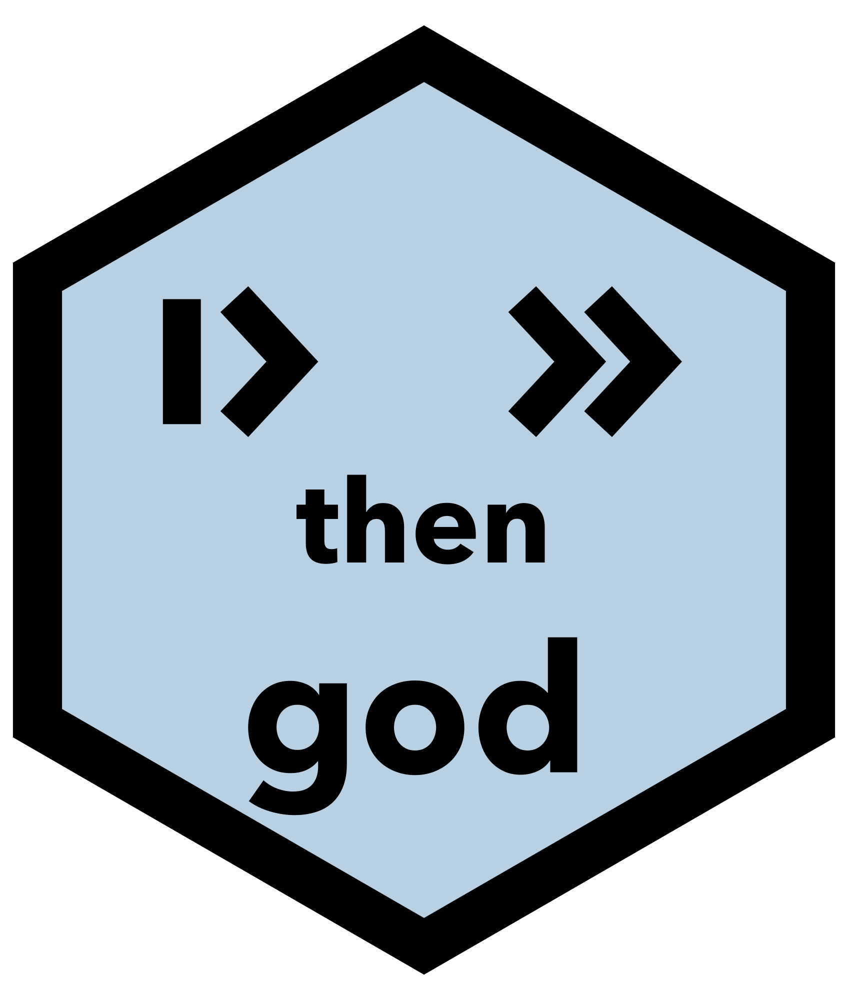
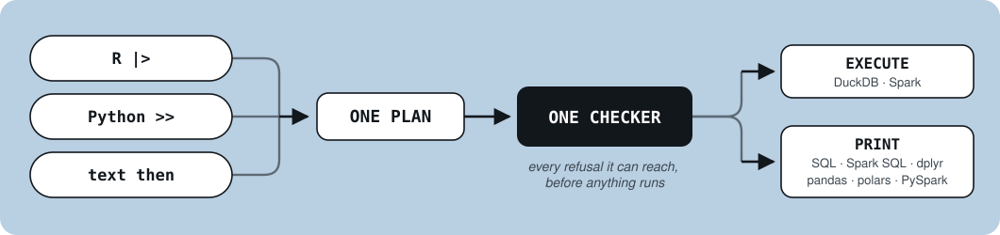

# god — a grammar of data



**Say it once. Run it anywhere.**

One small vocabulary for manipulating tables, spelled the same way in R, in
Python, and on a cluster. It is for the ordinary work: keep some rows, add a
column, group and count, sort, join, reshape. Every day, in whichever language
you are in.

```r
sales |> keep(region == "West") |> summarize(margin = total(margin), by = product)
```

Read it aloud: *keep the rows where the region is West; for each product, total
the margin.* That sentence is the whole program, and it is the same sentence in
Python and in plain text.

**📖 The manual is online, and every table in it was computed by this engine:
<https://psychometrician.github.io/god-book/>**

god is **G**rammar **O**f **D**ata, and its sibling
[gog](https://github.com/psychometrician/gog) is a grammar of graphics. Written
lowercase, always, the way dplyr and pandas are.

## Why

Data manipulation has many flavors and one core. Every tool in common use can
filter rows, derive a column, group and total, order and truncate, the same
handful of ideas. What differs is spelling, and the spellings do not agree:

```
dplyr       df |> group_by(g) |> summarise(total = sum(x))
pandas      df.groupby('g')['x'].sum().reset_index()
polars      df.group_by('g').agg(pl.col('x').sum().alias('total'))
data.table  df[, .(total = sum(x)), by = g]
SQL         SELECT g, SUM(x) AS total FROM df GROUP BY g
```

**The hard part of learning this is not the ideas.** It is that each tool's rules
for combining its parts collected exceptions over the years: pandas has three
ways to filter a row and an index that changes what `[]` means; SQL's clause
order is not its execution order; dplyr carries both `group_by()` and `.by`.

god takes its discipline from Hangeul, the Korean alphabet, by way of its sibling
project. The power there was never in having few letters, since English has few
letters and still takes years to write well. **The power is that the letters
combine without exceptions.** So this is a deliberately small kernel where a rule
you learn in one place holds in every other, answerable to stated laws, with one
promise:

> A beginner should be able to read any pipeline aloud on day one and write one
> themselves on day two.

And its working form: **if you can say it two ways, one of them is a bug.**

## The same sentence, in three spellings

```r
# R
sales |>
  keep(region == "West") |>
  add(margin = revenue - cost) |>
  summarize(margin = total(margin), orders = row_count(), by = product) |>
  sort(descending(margin)) |>
  take(10)
```

```python
# Python
(sales
  >> keep(col.region == "West")
  >> add(margin = col.revenue - col.cost)
  >> summarize(margin = total(col.margin), orders = row_count(), by = col.product)
  >> sort(descending(col.margin))
  >> take(10))
```

Same verbs, same order, same keyword names, same argument positions. **Two
differences, both learnable in one sentence:**

| | R | Python |
|---|---|---|
| pipe | `\|>` | `>>` |
| column | bare `revenue` | `col.revenue` |

### And where there is no language to bind into

A Databricks SQL cell, a config file, a pipeline you stored or generated. The
same grammar, written as text:

```
sales
  then keep where [region] is "West"
  then summarize [margin] as total([margin]) by [product]
```

Both spellings above produce exactly this, so a pipeline can move between a
script, a notebook and a warehouse without being rewritten. A sentence in this
form is data, so it can be stored and sent, and `run` executes one in either
language. Whoever writes a question and whoever runs it do not have to be the
same person.

## Status

| | |
|---|---|
| The grammar: parse, check, compile | ✅ fourteen verbs, thirty-one functions |
| Backends: SQL, Spark SQL, dplyr, pandas, polars, PySpark, and god itself | ✅ |
| A command line, and running it from R and Python | ✅ |
| The verbs written natively in both languages | ✅ |
| The reference manual, live in both languages | ✅ |
| Packaging | R installs today, below; Python's wheels are built and PyPI is next |

## Install

In R, from R-universe, as a binary, with no Rust needed:

```r
install.packages("god",
  repos = c("https://psychometrician.r-universe.dev", "https://cloud.r-project.org"))
```

Python is not released yet. When it is, it will be `pip install grammar-of-data`.
The distribution names differ because `god` was taken on PyPI in 2016 by an
unrelated package, and **the import is `god` in both languages regardless**.

## The vocabulary

**Verbs**, and the list is closed. `keep` · `pick` · `add` · `summarize` ·
`sort` · `take` · `join` · `add_rows` · `drop_duplicates` · `rename` ·
`drop_missing` · `fill_missing` · `lengthen` · `widen`

**Every verb is an imperative English verb, with no exceptions.** A pipeline is a
sequence of instructions, so a step named with a noun reads against the grain of
what it is. That is why choosing columns is `pick` and not `columns`.

**Functions.** `total` · `average` · `median` · `smallest` · `largest` ·
`first` · `last` · `row_count` · `unique_count` · `first_present` · `between`

**Along the rows.** `rank` · `row_number` · `running_total` · `previous` ·
`following`

**Dates.** `year` · `month` · `day` · `weekday` · `hour`, where `weekday` counts
Monday as 1 wherever it runs

**Text.** `lower` · `upper` · `trim` · `characters` · `replace_text` ·
`split_text`

**Converting**, always written out, never on your behalf. Every one begins
`to_`, and nothing else does: `to_number` · `to_whole` · `to_text` · `to_date`

**The conditional.** `when(question, answer, …, otherwise = )`, where the first
question that is true wins.

The engine prints this list itself, with `god-cli --vocabulary`, so nothing has
to keep a second copy of it in step.

**Words where the hosts disagree**, replaced by one that means the same
everywhere: `is` for equality, `yes` and `no` for truth, `missing` for the absent
value, `in { … }` for membership, `and` · `or` · `not`.

Every one of these is checked against what the name already means elsewhere. A
word that would read as one thing and do another is renamed, which is why
appending rows is `add_rows` and not `stack`, since `utils::stack` reshapes to
long format and would have been the dangerous kind of collision.

## Architecture

<p align="center">
  
</p>

**god is not an engine and does not pretend to be one.** It owns the words, the
checking and the error messages; the joining, grouping, sorting and null handling
belong to an engine underneath. `god-core` has **no dependencies at all**. It
turns text into a plan and a plan into text, and neither job needs a library.

Because the whole pipeline is read before anything runs, a bad column is reported
at step two rather than at step seven, with a caret under the word:

```
illegal: there is no column called `reveune`. Did you mean `revenue`?
The table has: region, product, revenue, cost, ordered_on
  |
2 |   then keep where [reveune] > 100
  |                    ^^^^^^^
```

**A column can be called anything**, including a word the grammar uses. Each
spelling has an unambiguous answer: R looks names up in your data first, Python
writes `col.sort`, and the text form writes `[sort]`. No backticks, no escape
words, and no list of names you are forbidden to use.

### It shows you what it wrote

A small vocabulary covers most of what people do and never all of it. So when you
reach the edge, god hands you the same pipeline in a language you already know:

```
$ god --columns 'region:text,revenue:number' --as dplyr 'sales then keep where [region] is "West" then take 10'
sales |>
  filter((region == "West")) |>
  head(10)
```

**Knowing god is meant to make the tools you already use easier, not to replace
them.** The edge of the vocabulary is a doorway rather than a wall.

### So how fast is it?

That question has two answers, and keeping them apart is the honest way to ask
it.

**What god costs is compiling your pipeline**: reading it, checking it against
the columns, and writing the query. That is a fixed cost per pipeline rather than
per row, so it does not grow with your data. A hundred rows and a hundred million
rows compile in the same time.

**What everything else costs belongs to the engine you pointed it at.** god hands
DuckDB or Spark a query and steps out of the way. So a benchmark of "god against
polars" is really DuckDB against polars, and publishing it as god's number would
be taking credit, or blame, for somebody else's engine.

This is why there is no benchmark table here. The claim worth making is narrower
and testable: the grammar costs almost nothing to put in front of an engine, and
your query goes to that engine unchanged. If you want to know how fast the answer
comes back, benchmark the engine, and `show_as` will hand you the exact query to
time.

god's own goal is not speed. It is that you can still write a pipeline a year
after you last touched one.

## Build from source

Requires a Rust toolchain, and the language you want to drive it from.

```bash
cargo build --release          # the engine and the command line
cargo test --release           # the core, every backend, and the verbs on DuckDB
```

Both packages find `target/release/god-cli` by walking up from where they are
installed, so neither needs anything configured after a build.

```bash
Rscript r-pkg/god/tests/test_basic.R     # the R binding, and the book's guards
python3 py-pkg/god/tests/test_basic.py   # the Python binding, and its harnesses
python3 parity/check.py                  # one corpus, three spellings, four witnesses each
```

## The book

`book/` is the manual, written in Quarto, and **every table in it is live**,
computed by the engine as the page builds. Nothing is pasted; if a page shows a
result, the engine produced it. Refusals are live too, in both languages, so an
error message is something you have already read before one finds you.

```bash
cd book && quarto preview
```

It opens with one pipeline read aloud, then takes the verbs a family at a time,
then reshaping, then a cookbook organized by the question you are asking rather
than by the verb that answers it.

Read it without building it at
<https://psychometrician.github.io/god-book/>.

## Contributing

[`CONTRIBUTING.md`](CONTRIBUTING.md) has the laws the grammar obeys, the module
map, where a rule is allowed to live, and what to run before opening a pull
request.

## Related

**[gog](https://github.com/psychometrician/gog)** is the sibling project, a
grammar of graphics with the same shape and the same discipline: a small kernel,
stated laws, and a live manual that is also the test suite.

## License

Code is **Apache License 2.0**, see [LICENSE](LICENSE), and [NOTICE](NOTICE).
Each binding keeps its own copy of both, because a wheel and an R package are
each built from a directory below this one, so a copy has to sit there.

The book's prose is **CC BY-NC-SA 4.0**, see [book/LICENSE.md](book/LICENSE.md).
